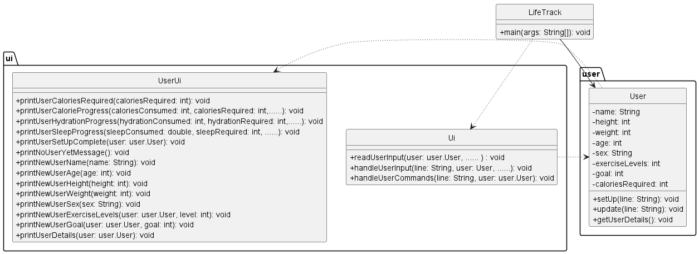
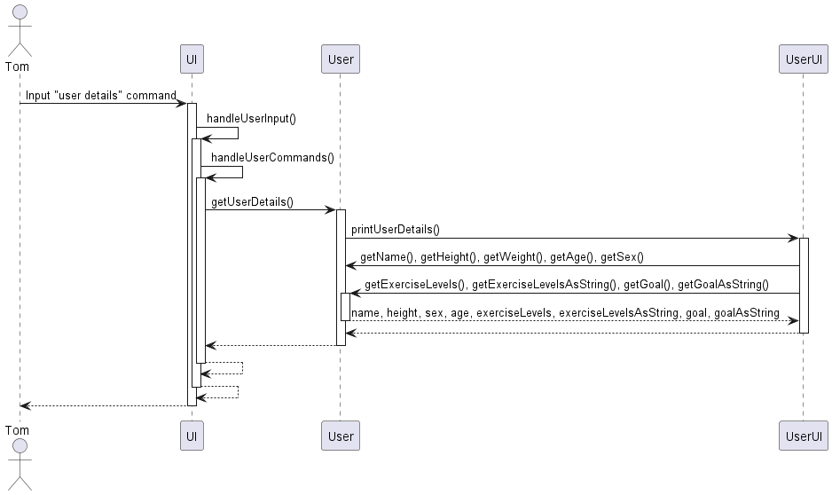
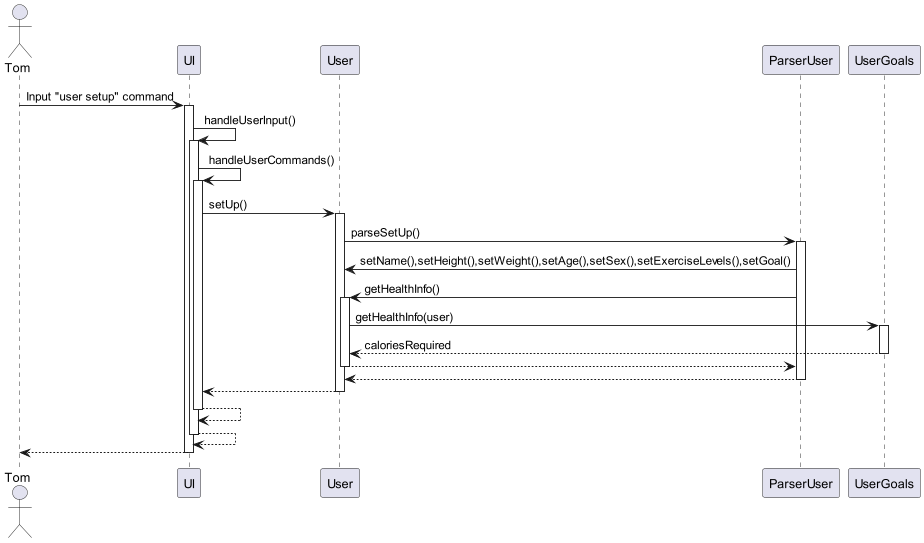
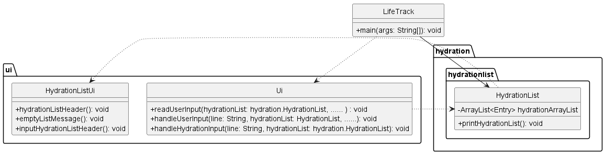

# Developer Guide

## Quick links
* [Acknowledgements](#acknowledgements)
* [Design](#design)
  * [Calories component](#calories-component)
  * [Hydration component](#hydration-component)
  * [Sleep component](#sleep-component)
  * [User component](#user-component)
* [Implementation](#implementation)
  * [Adding calorie entries feature](#adding-calorie-entries-feature)
  * [Calculating calorie requirements based on user's goals](#calculating-calorie-requirements-based-on-a-users-goals)
  * [Calories list feature](#calories-list-feature)
  * [Calories delete feature](#calories-delete-feature)
  * [Parsing user input for hydration entries](#parsing-user-input-for-hydration-entries)
  * [Calculating hydration requirements for each user](#calculating-hydration-requirements-for-each-user)
  * [Hydration list feature](#hydration-list-feature)
  * [Hydration delete feature](#hydration-delete-feature)
  * [Adding sleep entries feature](#adding-sleep-entries-feature)
  * [User details feature](#user-details-feature)
  * [Parsing user input for sleep entries](#parsing-user-input-for-sleep-entries)
  * [Sleep list feature](#sleep-list-feature)
  * [Sleep delete feature](#sleep-delete-feature)
  * [Calculating sleep requirements for each user (Planning)](#calculating-sleep-requirements-for-each-user-planning)
* [Appendix A: Product scope](#appendix-a-product-scope)
* [Appendix B: User Stories](#appendix-b-user-stories)
* [Appendix C: Non-Functional Requirements](#appendix-c-non-functional-requirements)
* [Appendix D: Glossary](#appendix-d-glossary)
* [Appendix E: Instructions for manual testing](#appendix-e-instructions-for-manual-testing)

## Acknowledgements

{list here sources of all reused/adapted ideas, code, documentation, and third-party libraries -- include links to the original source as well}
## Design

### Calories component
Here's a (partial) class diagram of the `calories` component.

The calories component consists of the following Classes
1. `Ui` : Handles user and program interaction.
2. `CalorieList` : Handles the list of calories entries.
3. `CaloriesFileHandler` : Handles the saving and reading of data from file.
4. `ParserCalories` : Handles the parsing of user input to determine type of command.
5. `Entry` : Handles calories entries data.
6. `OutputEntry` : Handles calories output entries data.
7. `InputEntry` : Handles calories input entries data.
8. `Food` : Handles macronutrients data for calories input.

The sequence diagram bellow illustrates the interactions within the `calories` component, taking
`calories in donut c/1000 d/2024-04-10` call as an example. 

How the `calories` component works:
1. When the user keys in the `calories in donut c/1000 d/2024-04-10` command, 
the input is sent to `Ui#handleCaloriesInput(String, CalorieList)`, which calls 
`CalorieList#addEntry(String)`.

2. Inside `CalorieList#addEntry(String)`, the function `ParserCalories#parseCaloriesInput(String, int)` 
is then called to extract information such as the description, number of calories, and date of entry.

3. With the extracted information, the function `ParserCalories#makeNewInputEntry(int, String, int, String)`
is called, which creates a new entry of `InputEntry` that extends `Entry`. The `InputEntry` object is then returned
to the caller, `CalorieList#addEntry(String)` which was called in step 2.

4. The returned `InputEntry` object is added into the `calorieArrayList` member of type
`ArrayList<Entry>` in the `CalorieList`, via the `ArrayList.add()` method. 

5. `CalorieList#UpdateFile()` is then called, which calls `CaloriesFileHandler#writeEntries(ArrayList<Entry>)`.
Within that function, `CaloriesFileHandler#writeToFile(String)` function is called, which writes the new data
into the data file. 

6. If the dates of entries are not sorted in ascending order, `CalorieList#sortEntriesByDate()`
function is called, which sorts the entries in ascending order. 

### Hydration component

### Sleep component
Here's a (partial) class diagram of the `sleep` component.

The sleep component consists of the following classes:
1. `Ui`: Handles user and program interaction.
2. `SleepList`: Handles the list of sleep records.
3. `SleepFileHandler`: Handles the saving and reading of data from the file.
4. `ParserSleep`: Handles the parsing of user input to determine type of command.
5. `Entry`: Handles all entries data.
6. `SleepEntry`: Handles sleep entries data.

The sequence diagram bellow illustrates the interactions within the `sleep` component, taking `sleep add 7 d/2024-04-13` 
call as an example.

How the `sleep` component works:
1. When the user keys in the`sleep add 7 d/2024-04-13` command,
   the input is sent to `Ui#handleSleepInput(String, SleepList)`, which calls
   `SleepList#addSleep(String)`.

2. Inside `SleepList#addSleep(String)`, the function `ParserSleep#parseSleepInput(String)`
   is then called to extract information such as the duration and date by calling `parseDate(String)` and `parseDuration(String)`.

3. With the extracted information,a new entry of `SleepEntry` that extends `Entry` will be created. The `SleepEntry` object is then returned
   to the caller, `SleepList#addSleep(String)` which was called in step 2.

4. The returned `SleepEntry` object is added into the `sleepList` member of type
   `ArrayList<Entry>` in the `SleepList`, via the `ArrayList.add()` method.

5. `SleepList#UpdateFile()` is then called, which calls `SleepFileHandler#writeEntries(ArrayList<Entry>)`.
   Within that function, `SleepFileHandler#writeToFile(String)` function is called, which writes the new data
   into the data file.

### User component

How does `user` component work using `user setup` command as an example:
1. When the user keys in the `user setup` command, the input is sent to `Ui#handleUserCommands(String, User)`, which calls `User#setUp(String)`.
2. Inside `User#setUp(String)`, the function `ParserUser#parseSetUp(String, User)` is then called to extract information such as name, height, weight, age, sex, exerciseLevels, goals. The information is then stored int he `User` class.
3. The function `#UserFileHandler#writeUserData(User)` is then called, which calls `#UserFileHandler#writeToFile(String)` which updates user data to the file.

## Implementation
### Adding calorie entries feature

#### Implementation

This functionality is facilitated by `UI`, `CalorieList`, and `ParserCalories`. It implements one operation, namely:
- `UI#handleCaloriesInput(String, CalorieList)`
- `CalorieList#addEntry(String)`
- `CalorieList#updateFile()`
- `ParserCalories#parseCaloriesInput(String)`

This feature is activated when the user inputs a `calories in` or `calories out` command in the terminal.

Given below is an example usage scenario and how this mechanism behaves at every step:

- Step 1: When the user inputs the command `calories in burger c/200 d/2024-02-02` in the terminal,
the string is sent to `UI#handleCaloriesInput(String, CalorieList)`, which calls `CalorieList#addEntry(String)`.

- Step 2: Inside `CalorieList#addEntry(String)`, the function `ParserCalories#parseCaloriesInput(String)` is then called to extract information such as the description, number of calories, and date of entry.

- Step 3: The obtained information is sent to the private method `ParserCalories#makeNewInputEntry(String, int, String)` to create a new entry of class `InputEntry` that extends `Entry`. An `Entry` object is then returned to the caller, `CalorieList#addEntry(String)`.

- Step 4: The returned `Entry` object is added into the `calorieArrayList` member of type `ArrayList<Entry>` in the `CalorieList`, via the `ArrayList.add()` method.

- Step 5: `CalorieList#updateFile()` is then called to update the data file with the new entry in the `CalorieList`.

The sequence diagram for this feature is shown below:

### User Details Feature

#### Implementation

This functionality is facilitated by `UI`, `User` and `UserUI` Classes. It implements the following
operation, namely:
- `UI#handleUserInput(String, User)`
- `UI#handleUserCommands(String, User)`
- `User#getUserDetails()`
- `UserUI#printUserDetails(User)`

This feature is activated when the user inputs `user details` command in the terminal.

Given below is an example usage scenario and how this mechanism behaves at every step:

- Step 1: When the user inputs the command `user details` in the terminal,
  the string is sent to `UI#handleUserInput(String, User)` and
  `UI#handleUserCommands(String, User)`, which calls `User#getUserDetails()`.

- Step 2: Inside `User#getUserDetails()`, the function `UserUI#printUserDetails(User)`
  is then called. The user's details are printed out.

- Step 3: After printing out the details, the program returns and awaits
  the next command typed in by user.

The class and sequence diagram for this feature is shown below:
Unrelated attributes and Classes were excluded.

### Calculating calorie requirements based on a user`s goals

#### Implementation

This functionality is facilitated by `UserGoals`. It implements one operation, namely:
- `UserGoals#getHealthInfo(User)`

This operation is exposed in the `User` class as `User#getHealhInfo()`.

Given below is an example usage scenario and how this mechanism behaves at every step:
- Step 1: When the user inputs the command `user setup` in the terminal, 
  the input string is sent to `Ui#handleUserCommands(User,String)`, which calls `User#setup(String)`.

- Step 2: `User#setup(String)` calls `ParserUser#parseSetUp(String, User)` which parses the user's information such as 
  his height, weight, age, gender, exercise levels and intended goal and sets these information to the `User`.

- Step 3: `User#setup(String)` then calls `User#getHealthInfo()` which calls `UserGoals#getHealthInfo(User)`.

- Step 4: This method calculates the basal metabolism rate of the `user` using the user's height, weight, age and gender.

- Step 5: Using the `user`'s exercise levels, the method calculates his active metabolism rate, and finally calculates the calories required by the user to achieve their goals based on their input.

- Step 6: This value is set to `User.caloriesRequired` by `User#setCaloriesRequired(int)`.

The Sequence Diagram for the above-mentioned process is as follows:

#### Design considerations

- **Alternative 1 (current choice):** Uses an algorithm to find the number of calories needed
  - Pros: Not dependent on external APIs
  - Cons: Need to come up with an algorithm to use

- **Alternative 2 :** Uses an API to get the calories needed
    - Pros: No need to figure out the optimal algorithm
    - Cons: Need to parse response to sieve out necessary information

### Calories list feature

#### Implementation

This functionality is facilitated by `UI` and `CalorieList` Classes. It implements the following
operation, namely:
- `UI#handleUserInput(String, CalorieList)`
- `UI#handleCaloriesInput(String, CalorieList)`
- `CalorieList#printCalorieList()`
- `CalorieList#printCalorieInflow()`
- `CalorieList#printCalorieOutflow()`

This feature is activated when the user inputs `calories list` command in the terminal.

Given below is an example usage scenario and how this mechanism behaves at every step:

- Step 1: When the user inputs the command `calories list` in the terminal,
  the string is sent to `UI#handleUserInput(String, CalorieList)` and 
`UI#handleCaloriesInput(String, CalorieList)`, which calls `CalorieList#printCalorieList()`.

- Step 2: Inside `CalorieList#printCalorieList()`, the function `CalorieList#printCalorieInflow()` 
is then called. Entries that are classified under `InputEntry` will be printed out.

- Step 3: Inside `CalorieList#printCalorieList()`, the function `CalorieList#printCalorieInflow()`
  is then called. Entries that are classified under `OuputEntry` will be printed out.

- Step 4: After printing out both the Input Entries and Output Entries, the program returns and awaits
the next command typed in by user. 

The class and sequence diagram for this feature is shown below:
Unrelated attributes and Classes were excluded.

#### Design considerations
- **Alternative 1 (current choice):** Use one arrayList and use instanceof to print out 
the Input Entries and Output Entries. 
  - Pros: Only 1 arrayList is required.
  - Cons: Need to loop the same arrayList twice, which is less efficient. Furthermore, 
  when deleting entries from arrayList, we need to use a unique entryID instead of using the 
  index of entry in the arrayList.

- **Alternative 2 :** Use 2 arraylists. One for Input Entries and one for Output Entries. 
  - Pros: More efficient, as each arrayList only needs to be looped through one time.
  Furthermore, we can directly delete entries based on index, and no unique entryID field will be required.
  - Cons: Troublesome to implement. Requires a lot of changes to current Class structure and code structure.

### Calories delete feature

The `calories delete` feature can delete the calories record at specific index of calorie list. This functionality is facilitated by `CaloriesList`. It implements one operation, namely:
- `deleteEntry(String line)`

Given below is an example usage scenario and how this mechanism behaves at every step:
- Step 1: When the user inputs the command `calories delete INDEX` in the terminal, the string is sent to `Ui#handleUserInput()`, which will call `Ui#handleCaloriesInput()`.

- Step 2: After the `Ui#handleCaloriesInput()` matching `delete calories` key word, the string will be passed into deleteEntry(String line) to execute delete process.

- Step 3: The string will be divided to two substrings according to the command syntax. Index will be tried to get from the second substring by `Integer.parseInt()`.

- Step 4: The calories record (`Entry`) stored in the `ArrayList<Entry> caloriesList` will be deleted by calling `calorieArrayList.remove((index-1));` and a successful deleting message will be shown in terminal by calling `CalorieListUi#successfulDeletedMessage(toDelete)`

- Step 5: The latest calories list will be updated to saving file by calling `CalorieList#updateFile()`.

The Class diagram for Calories delete feature is shown below:

### Parsing user input for hydration entries

This functionality is facilitated by `ParserHydration`. It implements one operation, namely:
- `ParserHydration#parseHydrationInput(String input)`

This operation is exposed in the `HydrationList` class as `HydrationList#addEntry(String)`.

Given below is an example usage scenario and how this mechanism behaves at every step:
- Step 1: When the user inputs the command `hydration in Milo v/100 d/2022-01-02` in the terminal,
  the string is sent to `HydrationList#addEntry(String)`, which calls `ParserHydration#parseHydrationInput(String)`.

- Step 2: Using `String.split()`, the method extracts information such as the description, volume of beverage, and date of entry. The obtained information is sent to the private method `ParserHydration#makeNewInputEntry(String, int, String)` to create a new entry of class `HydrationEntry` that extends `Entry`.

- Step 3: The created `HydrationEntry` instance is added into the `ArrayList<Entry>` attribute of the `HydrationList`.

### Calculating hydration requirements for each user

#### Design Considerations

**General Health Guidelines:** The recommended daily intake of water for an average adult is around 8 glasses or approximately 2000 milliliters. This guideline is commonly recommended by health authorities and organizations such as HealthHub.

**Ease of Implementation:** Setting a standard hydration requirement simplifies the tracking process for users. It provides a clear goal to strive for, making it easier for individuals to monitor and maintain their hydration levels consistently.

### Hydration list feature

The `hydration list` feature lists out the record of all the Hydration data that the user has keyed in. The Hydration data are all stored into a `ArrayList<Entry> hydrationArrayList` attribute of the `HydrationList` Class. Hydration data are printed when the `printHydrationList()` function is called.

The `printHydrationList()` function iterates through the `hydrationArrayList` and prints out the Entries according to its order in the Array List.

The Class diagram for Hydration list feature is shown below. Unrelated attributes and Classes were excluded.

### Hydration delete feature

The `hydration delete` feature can delete the hydration record at specific index of hydration list. This functionality is facilitated by `HydrationList`. It implements one operation, namely:
- `deleteEntry(String line)`

Given below is an example usage scenario and how this mechanism behaves at every step:
- Step 1: When the user inputs the command `hydration delete INDEX` in the terminal, the string is sent to `Ui#handleUserInput()`, which will call `Ui#handleHydrationInput()`.

- Step 2: After the `Ui#handleHydrationInput()` matching `delete hydration` key word, the string will be passed into deleteEntry(String line) to execute delete process.

- Step 3: The string will be divided to two substrings according to the command syntax. Index will be tried to get from the second substring by `Integer.parseInt()`.

- Step 4: The hydration record (`Entry`) stored in the `ArrayList<Entry> hydrationList` will be deleted by calling `hydrationArrayList.remove((index-1));` and a successful deleting message will be shown in terminal by calling `HydrationListUi#successfulDeletedMessage(toDelete)`

- Step 5: The latest hydration list will be updated to saving file by calling `HydrationList#updateFile()`.

The Sequence diagram for Hydration delete feature is shown below:

### Adding sleep entries feature

#### Implementation

This functionality is facilitated by `UI`, `SleepList`, `FileHandler` and `ParserSleep`. It implements one operation, namely:
- `UI#handleSleepInput(String,SleepList)`
- `SleepList#addEntry(String)`
- `ParserSleep#parseSleepInput(String)`
- `FileHandler#updateFile()`

This feature is activated when the user inputs a `sleep add` command in the terminal.

Given below is an example usage scenario and how this mechanism behaves at every step:

- Step 1: When the user inputs the command `sleep add 7.5 d/2022-01-02` in the terminal,
  the string is sent to `UI#handleSleepInput(String, SleepList)`, which calls `SleepList#addSleep(String)`.

- Step 2: Inside `SleepList#addSleep(String)`, the function `ParserSleep#parseSleepInput(String)` is then called to extract information such as the duration and date of entry.

- Step 3: It will create a new entry of class `SleepEntry` that extends `Entry`based on the information.

- Step 4: The created `SleepEntry` instance is added into the `ArrayList<Entry> sleepList` attribute of the `SleepList`.

- Step 5: `FileHandler#updateFile()` is then called to update the data file with the new entry in the `SleepList`.

The sequence diagram for this feature is shown below:

### Parsing user input for sleep entries

This functionality is facilitated by `ParserSleep`. It implements one operation, namely:
- `ParserSleep#parseSleepInput(String input)`

This operation is exposed in the `SleepList` class as `SleepList#addSleep(String)`.

Given below is an example usage scenario and how this mechanism behaves at every step:
- Step 1: When the user inputs the command `sleep add 7.5 d/2022-01-02` in the terminal,
  the string is sent to `SleepList#addEntry(String)`, which calls `ParserSleep#parseSleepInput(String)`.

- Step 2: Using `String.split()`, the method extracts information such as the duration and date of entry.

- Step 3: It will create a new entry of class `SleepEntry` that extends `Entry`based on the information.

- Step 4: The created `SleepEntry` instance is added into the `ArrayList<Entry> sleepList` attribute of the `SleepList`.

### Sleep list feature

The `sleep list` feature lists out the record of all the sleep data that the user has keyed in. The sleep data are all stored into a `ArrayList<Entry> sleepList` attribute of the `SleepList` Class. Sleep data are printed when the `printSleepList()` function is called.

The `printSleepList()` function iterates through the `sleepList` and each entry will call `SleepEntry#toString()` to return its information string to be printed.

The Sequence diagram for Sleep list feature is shown below. Unrelated attributes and Classes were excluded.

### Sleep delete feature

The `sleep delete` feature can delete the sleep record at specific index of sleep list. This functionality is facilitated by `SleepList`. It implements one operation, namely:
- `deleteSleep(String line)`

Given below is an example usage scenario and how this mechanism behaves at every step:
- Step 1: When the user inputs the command `sleep delete INDEX` in the terminal, the string is sent to `Ui#handleUserInput()`, which will call `Ui#handleSleepInput()`.

- Step 2: After the `Ui#handleSleepInput()` matching `sleep delete` key word, the string will be passed into deleteSleep(String line) to execute delete process.

- Step 3: The string will be divided to two substrings according to the command syntax. Index will be tried to get from the second substring by `Integer.parseInt()`.

- Step 4: The sleep record (`Entry`) stored in the `ArrayList<Entry> sleepList` will be deleted by calling `sleepArrayList.remove((index-1));` and a successful deleting message will be shown in terminal by calling `SleepListUi#successfulDeletedMessage(toDelete)`

- Step 5: The latest sleep list will be updated to saving file by calling `SleepList#updateFile()`.

The Sequence diagram for Sleep delete feature is shown below:

### Calculating sleep requirements for each user (Planning)

#### Design Considerations

**General Health Guidelines:** The recommended daily sleep duration for an average adult is around 7.5 hours. However, sleep standard is different for different individual with different healthy status. This feature will calculate recommend sleep duration by formula based on user health information.

**Ease of Implementation:** Setting a standard sleep requirement simplifies the tracking process for users. It provides a clear goal to strive for, making it easier for individuals to monitor and maintain their sleep time levels consistently.

## Appendix A: Product scope
### Target user profile
* Year 2 NUS Computer Engineering (CEG students)
* can type fast
* is reasonably comfortable using CLI apps

### Value proposition

It is no secret that Year 2 is the busiest/most difficult period that CEG students will experience in university. 
As such, it may be easy for students to neglect their health in the midst of the hustle and bustle. We hope that through
this application, tracking one's health can be made easy and straightforward, so that students can get their health info
quickly on the go, and thus know whether they need to eat/drink/sleep more/less.

## Appendix B: User Stories

| Version | As a ...     | I want to ...                                                                                                                                                              | So that I can ...                                                      |
|---------|--------------|----------------------------------------------------------------------------------------------------------------------------------------------------------------------------|------------------------------------------------------------------------|
| v1.1    | busy student | register my calorie gained by inputting the food consumed, amount of calories and date                                                                                     | track my calorie gained history                                        |
| v1.1    | busy student | register my calories burnt by simply inputting the name of the activity, calories burnt and date                                                                           | track my burned outflow status                                         |
| v1.1    | busy student | add my macronutrient details into my calorie entries, such as protein, carbohydrates and fats                                                                              | better track my nutrition                                              |
| v1.1    | busy student | see my daily calories burned and consumed at a glance                                                                                                                      | get a summary of my calorie status                                     |
| v1.1    | busy student | delete my calories burned data                                                                                                                                             | remove data that was keyed in wrongly                                  |
| v1.1    | busy student | delete my calories gained data                                                                                                                                             | remove data that was keyed in wrongly                                  |
| v1.1    | busy student | add my daily hydration intake                                                                                                                                              | track how hydrated I am daily                                          |
| v1.1    | busy student | delete my daily hydration intake data                                                                                                                                      | remove wrong hydration data                                            |
| v1.1    | busy student | see my hydration record at a glance                                                                                                                                        | have an idea of how much water I have been drinking so far             |
| v2.0    | busy student | add my daily sleep hours                                                                                                                                                   | track my daily sleeping hours                                          |
| v2.0    | busy student | delete my daily sleep hours                                                                                                                                                | remove wrong sleeping data                                             |
| v2.0    | busy student | see my sleep hours data at a glance.                                                                                                                                       | track my sleep status                                                  |
| v2.0    | busy student | see my calorie input and output sorted according to days                                                                                                                   | see what my calorie intake and outflow for each day is                 |
| v2.0    | busy student | delete my calories entries based on the entry id                                                                                                                           | delete entries based on entry id, instead of based on array list index |
| v2.0    | busy student | see my daily calorie goals on a progress bar                                                                                                                               | better visualise my daily progress                                     |
| v2.0    | busy student | see my daily sleep goals on a progress bar                                                                                                                                 | better visualise my daily progress                                     |
| v2.0    | busy student | see my daily hydration goals on a progress bar                                                                                                                             | better visualise my daily progress                                     |
| v2.0    | busy student | store my personal details such has height, weight, age, gender, exercise levels and body goals for the program calculator to calculate my recommended daily caloric intake | hit my body goals and be healthier                                     |

## Appendix C: Non-Functional Requirements
1. Should work on mainstream OS as long as it has Java `11` installed.
2. A user with above average typing speed for regular English text (i.e. not code, not system admin commands) should be able
to accomplish most of the tasks fast and efficiently.
3. Calories, sleep and hydration data should be accurately recorded and stored without loss if users follow instructions on app usage. 
4. Data retrieval and display operations such as listing calories, sleep or hydration entries should be completed within 5 seconds.
5. Error messages should be descriptive and provide actionable or intuitive guidance to users on how to resolve issues.
6. The app codebase should be well-organised and documented to facilitate future updates and maintenance by development teams.

## Appendix D: Glossary
* Mainstream OS: Windows, Linux, Unix, MacOS

## Appendix E: Instructions for manual testing

### Adding calories intake entries
1. Test case: `calories in burger c/100 d/2024-04-15`

   Expected: Calories entry is added to the calories list.

2. Test case: `calories in burger c/100 d/2024-04-15 m/19,10,10`

   Expected: Calories entry with macronutrients is added to the calories list.

3. Test case: `calories in burger c/-1 d/2024-04-15`

   Expected: Calories entry is not added into calories list. Error details shown in message.

4. Test case: `calories in burger c/100 c/100 d/2024-04-15`

   Expected: Calories entry is not added into calories list. Error details shown in message.

5. Test case: `calories in burger d/2024-04-15`

   Expected: Calories entry is not added into calories list. Error details shown in message.

### Adding calories outflow entries

1. Test case: `calories out run c/100 d/2024-04-15`

   Expected: Calories entry is added to the calories list.

2. Test case: `calories out go gym c/-1 d/2024-04-15`

   Expected: Calories entry is not added into calories list. Error details shown in message.

3. Test case: `calories out run c/100 c/100 d/2024-04-15`

   Expected: Calories entry is not added into calories list. Error details shown in message.

4. Test case: `calories out play softball d/2024-04-15`

   Expected: Calories entry is not added into calories list. Error details shown in message.

### Listing calories entries
1. Prerequisites: Calories data has already been added into calories list.
2. Test case: `calories list`

   Expected: List of calories data is displayed.

### Deleting calories entries
1. Prerequisites: Calories data has already been added into the Calories list.
2. Test case: `calories list`, followed by `calories delete 1`

    Expected: Calories entry with `SLEEPID` 1 is deleted from list. 

3. Test case: `sleep list`, followed by `sleep delete -1`

   Expected: No sleep entry deleted. Error details shown in message.

### Searching for calories item or items
1. Prerequisites: Calories data with `cream` has already been added into the Calories list.
2. Test case: `calories find cream`
   Expected: Calories entry with keyword cream in description is shown.

### Adding hydration entries
1. Test case: `hydration in water v/500 d/2024-04-15`

    Expected: Hydration entry is added to the hydration list.

2. Test case: `hydration in water v/500 d/24-04-15`

    Expected: No hydration entry is added to the hydration list. Error details shown in message.

3. Test case: `hydration in water d/2024-04-15 v/500`

    Expected: No hydration entry is added to the hydration list. Error details shown in message.

### Listing hydration entries
1. Prerequisites: Hydration data has already been added into hydration list.
2. Test case: `hydration list`

   Expected: List of hydration data is displayed.

### Deleting a hydration entry
1. Prerequisites: hydration data has already been added into hydration list.
2. Test case: `hydration list, followed by hydration delete 1`

   Expected: Hydration entry with HYDRATIONID 1 is deleted from list.

3. Test case: hydration list, followed by hydration delete -1

   Expected: No hydration entry deleted. Error details shown in message.

### Searching for hydration item or items
1. Prerequisites: Hydration data with `milo` has already been added into the Hydration list.
2. Test case: `hydration find milo`
   Expected: Hydration entry with keyword milo in description is shown.

### Adding sleep entries
1. Test case: `sleep add 7 d/2024-04-15`
  
    Expected: Sleep entry is added to the sleep list.

2. Test case: `sleep add 7 d/20-04-15`

   Expected: No sleep entry is added to the sleep list. Error details shown in message.

3. Test case: `sleep add 25 d/20-04-15`

   Expected: No sleep entry is added to the sleep list. Error details shown in message.

### Listing sleep entries
1. Prerequisites: Sleep data has already been added into sleep list.
2. Test case: `sleep list`

    Expected: List of sleep data is displayed.

### Deleting a sleep entry
1. Prerequisites: Sleep data has already been added into sleep list.
2. Test case: `sleep list`, followed by `sleep delete 1`
    Expected: Sleep entry with `SLEEPID` 1 is deleted from list.
3. Test case: `sleep list`, followed by `sleep delete -1`
    Expected: No sleep entry deleted. Error details shown in message. 

### Setup user details
1. Prerequisites: User details already populated with User Setup.
2. Test case: `user details`

   Expected: List of user details is displayed.

### Listing user details
1. Prerequisites: User details already populated with User Setup.
2. Test case: `user details`

   Expected: List of user details is displayed.

### Updating user details
1. Prerequisites: User details already populated with User Setup.
2. Test case: `user update height 170`

   Expected: User details height updated.

### Viewing user progress
1. Prerequisites: User details already populated with User Setup. Calories and hydration and sleep lists have been
populated with some entries.
2. Test case: `user progress`

   Expected: User progress is shown for calories, hydration and sleep.

